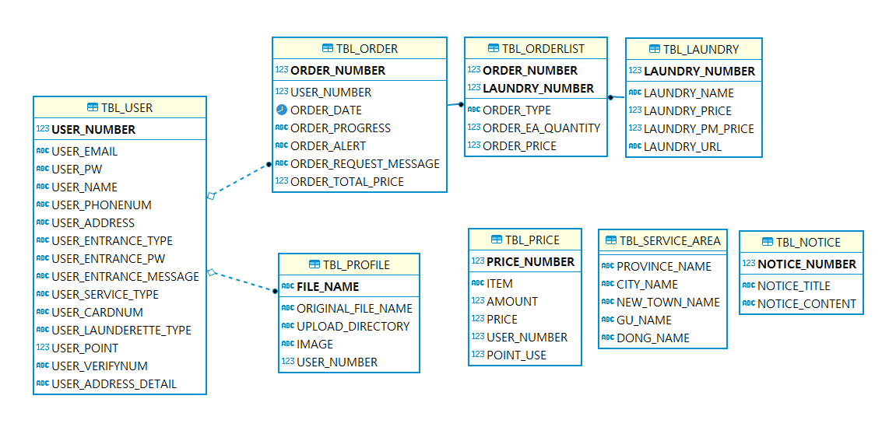

# washgogo
- spring 프로젝트 (http://localhost:20000/index)
- 누구나 쉽고 간편하게 세탁 서비스 이용

# 프로젝트 목적
공간이 협소하거나 시간이 없어 제약되는 상황에 처한 이들, 세탁방법이 어려워 곤혹스러운 이들, 큰 이벤트에 사용할 깨끗한 의류들이 필요한 이들을 위해 누구나 쉽고 간편하게 깨끗하고 청결한 의류를 입을 수 있으면 하는 바람으로 제작하게 되었습니다.

# 구현 기술 스택 
- SpringBoot 
- Oracle (11g XE)
- MyBatis (3.5.9)
- JDBC
- Thymeleaf
- Lombok
- Spring Web
- Java, HTML, CSS, JS
- Ajax
- IntelliJ
- kakao페이 api
- Maven Project

# 팀원 
- 우재현
	- Business Tier
	- Presentation Tier
	- 마이페이지
	- DB
- 송민경
	- 메인페이지 페이지
	- 이용 서비스 페이지
	- 마이페이지 프로필사진
	- DB
- 이성훈
	- Persistence Tier
	- 수거 신청 페이지
	- 이용 내역 페이지
	- DB
- 이주홍
	- 로그인 페이지
	- 회원가입 페이지
	- 마이페이지 이용서비스변경
	- DB
- 진현성
	- 공지사항 페이지
	- 결제 API

# ERD

